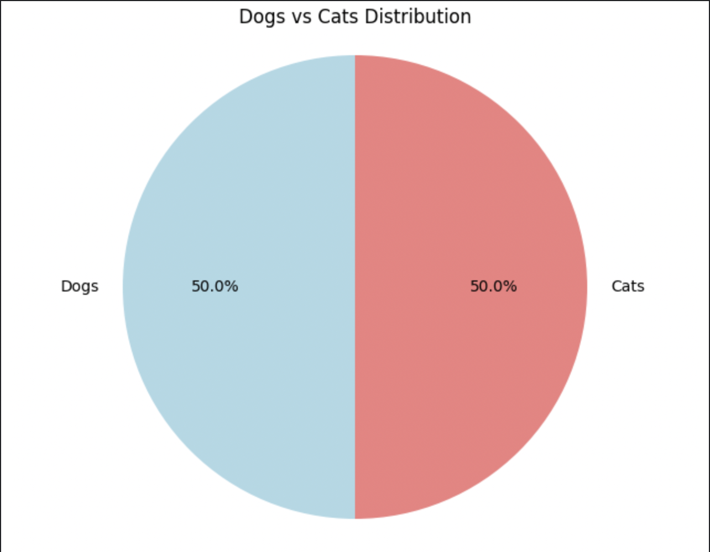
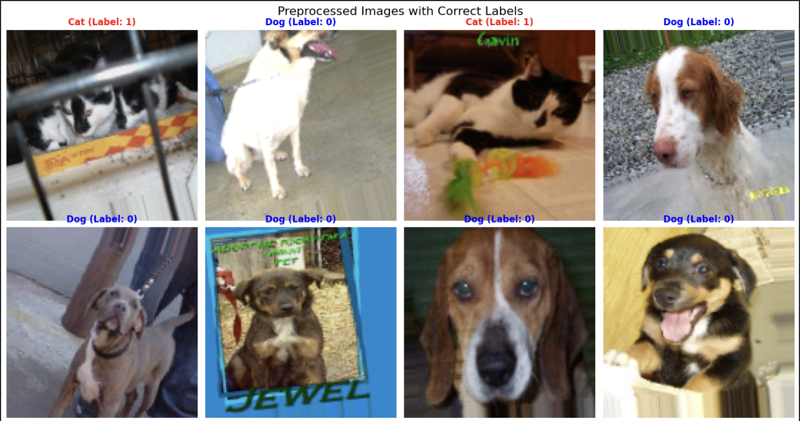

# 1. Project Setup and Data Preparation

---

This section summarizes the environment setup, the dataset details, and the steps taken for detailed image preprocessing before training the model.

### 1.1 Environment and Setup

The project was executed in a high-performance environment to ensure fast training:

* **Deep Learning Framework:** TensorFlow version **2.18.0**
* **Hardware:** A **GPU** (`/physical_device:GPU:0`) was detected and utilized for accelerated training.

### 1.2 Dataset Overview

The project uses the **Kaggle Dogs vs Cats dataset**. We verified the files and checked the class distribution:

* **Total Training Images:** **25,000**
* **Test Images:** **12,500**
* **Class Balance:** The training set is perfectly balanced: **12,500 Dogs (50.0%)** and **12,500 Cats (50.0%)**.

📌 Dataset and Project Links:  
- [Kaggle Dogs vs Cats Competition](https://www.kaggle.com/c/dogs-vs-cats)  
- [Project Notebook (Taylan Taşkın)](https://www.kaggle.com/code/taylantakn/dogs-vs-cats-classification-project/edit/run/264017772)

### 1.3 Data Preprocessing Details

The images were processed to prepare them for the Convolutional Neural Network (CNN):

* **Resizing:** All images were resized to a fixed size of **128x128** pixels.
* **Batch Size:** Images are fed to the model in batches of **32**.
* **Data Split:** The 25,000 training images were split into three sets:
    * **Training Set:** **15,000** images
    * **Validation Set:** **5,000** images
    * **Test Set:** **5,000** images
* **Data Augmentation:** To make the model more robust and prevent overfitting, random transformations (including **rotation, shifting, zooming, and flipping**) were applied **only to the training set**.

---

# 2. Model Development and Evaluation

---

This section details the **Convolutional Neural Network (CNN)** architecture, the training process, and the final performance metrics achieved on the test dataset.

### 2.1 CNN Model Architecture

A simplified CNN architecture was constructed using **three sequential convolutional blocks** (Conv2D, MaxPooling2D, Dropout) followed by Dense layers for final classification.

* **Total Trainable Parameters:** **8,482,369**
* **Input Size:** 128x128x3 (RGB images)
* **Optimization:** **Adam** optimizer (Learning Rate = 0.0005)
* **Loss Function:** Binary Crossentropy

| Layer Group | Function | Filters |
| :--- | :--- | :--- |
| **Conv Block 1** | Feature Extraction | 32 |
| **Conv Block 2** | Feature Extraction | 64 |
| **Conv Block 3** | Feature Extraction | 128 |

### 2.2 Training and Results

The model was trained for **15 epochs** using callbacks like **EarlyStopping** and **ReduceLROnPlateau**.

| Metric | Training Set Result | Validation Set Result |
| :--- | :--- | :--- |
| **Final Accuracy** | 0.7718 | **0.7997** |
| **Final Loss** | 0.4739 | **0.4294** |

The model was evaluated on the unseen **5,000-image Test Set**.

* **Test Accuracy:** **0.8061 (80.61%)**
* **Test Loss:** 0.4137

### 2.3 Detailed Evaluation Metrics

#### Classification Report

The model's performance is well-balanced between the two classes:

| Class | Precision | Recall | F1-Score |
| :--- | :--- | :--- | :--- |
| **Dogs (Class 0)** | 0.7999 | **0.8172** | 0.8085 |
| **Cats (Class 1)** | **0.8126** | 0.7949 | 0.8037 |

#### 📈 Confusion Matrix (4992 Samples)

| Predicted Class → | **True Dog** | **True Cat** |
| :--- | :--- | :--- |
| **Model Predicted Dog** | **2,043** (Correctly Identified) | 511 (Misclassified) |
| **Model Predicted Cat** | 457 (Misclassified) | **1,981** (Correctly Identified) |

### 2.4 Known Issues

1.  **Model Saving Error:** A filename error occurred during saving (`.weights.h5` extension was required).
2.  **Grad-CAM Error:** **Grad-CAM visualizations** (for model interpretability) failed due to a technical error.

---

# 3. Quick Hyperparameter Optimization

---

This section documents the quick tests performed to identify the best model configuration for final training, focusing on **Dropout Rate** and **Learning Rate**. The goal was to find a better starting point than the baseline model, saving significant time compared to a full search.

### 3.1 Test Configurations

Three quick tests were run for 5 epochs each on a subset of the data:

| Config | Dropout Rate | Learning Rate | Parameters |
| :--- | :--- | :--- | :--- |
| **baseline** | 0.5 | 0.0001 | 25,783,873 |
| **more_dropout** | **0.7** | 0.0001 | 25,783,873 |
| **higher_lr** | 0.5 | **0.0010** | 25,783,873 |

### 3.2 Comparison Results (5 Epochs)

The comparison focused on validation accuracy and the overfitting gap (Difference between Train and Val Accuracy).

| Config | Val Accuracy | Train Accuracy | Overfitting Gap | Fit Analysis |
| :--- | :--- | :--- | :--- | :--- |
| **baseline** | 0.4031 | 0.5412 | 0.1381 | HIGH OVERFITTING |
| **more_dropout** | **0.9406** | 0.5525 | -0.3881 | GOOD FIT |
| **higher_lr** | 0.9328 | 0.5188 | -0.4141 | GOOD FIT |

### 3.3 Best Configuration

The **`more_dropout`** configuration showed the highest validation accuracy and the best fit:

* **BEST CONFIGURATION:** `more_dropout`
* **Best Validation Accuracy:** **0.9406**
* **Key Parameters:** `dropout_rate`: **0.7**, `learning_rate`: **0.0001**

### 3.4 Extended Training with Best Config

The best configuration (`more_dropout`) was tested for 8 epochs to confirm stability.

| Epoch | Final Val Accuracy | Final Val Loss |
| :--- | :--- | :--- |
| **Extended Run (8 Epochs)** | **0.7802** | 0.6397 |

*(Note: The validation accuracy dropped in the extended run compared to the 5-epoch test, suggesting the initial high accuracy might be unstable or related to the quick test setup. However, the model configuration itself is saved for further use.)*

### 3.5 Conclusion and Next Steps

The quick optimization successfully identified better hyperparameters:

* **Recommendation:** Use `dropout_rate = 0.7` and `learning_rate = 0.0001` for the final model training.
* **Time Saved:** Approximately **80%** compared to a full hyperparameter search.
* **Model:** The best configuration model (`best_hyperparams_model.h5`) was saved for final training.
